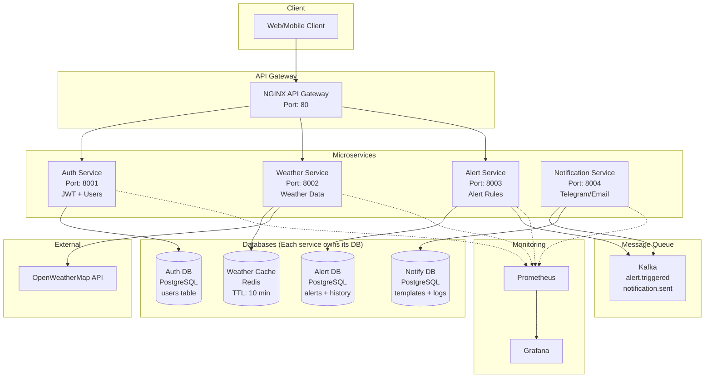
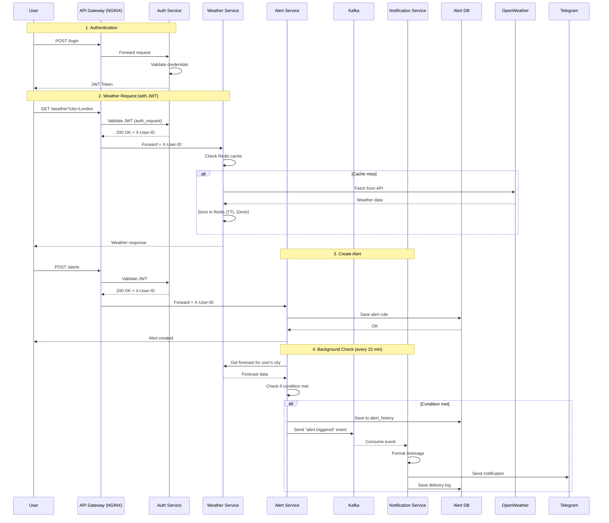
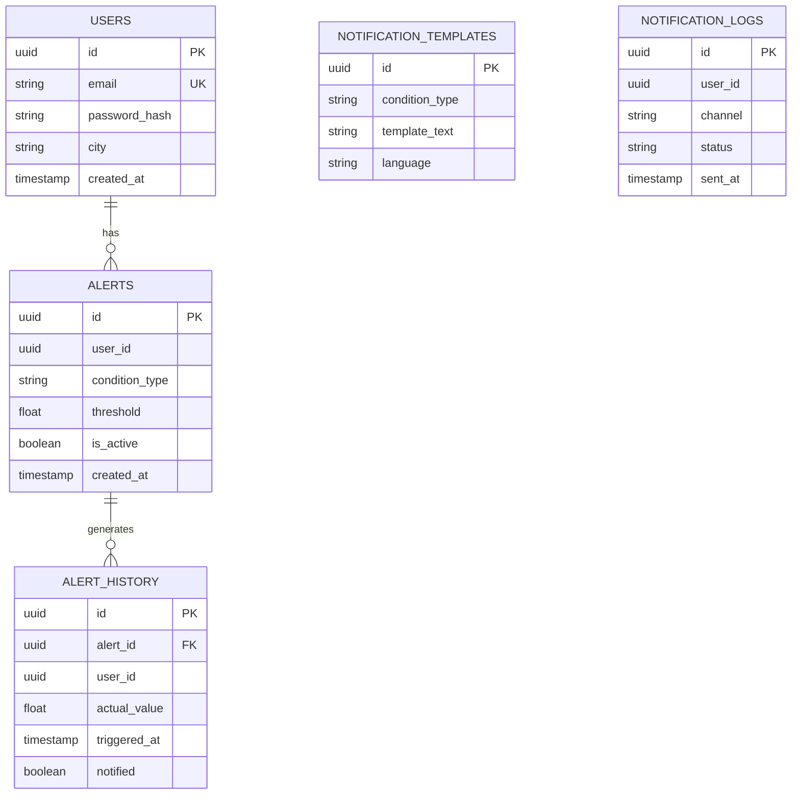

# Weather-Alert-Service

A production-ready microservices-based weather alert system with real-time notifications, load balancing, and comprehensive monitoring.

## Overview

Weather Alert Service allows users to register, set custom weather-based alerts (temperature thresholds, rain, snow, etc.), and receive real-time notifications when conditions are met. Built with a microservices architecture, it demonstrates infrastructure as code, load balancing, distributed messaging with Kafka, and observability patterns.

## Team

---

## Architecture

### System Architecture Diagram



### Request Flow Sequence Diagram



### Database Schema (Per Service)



---

## Technology Stack

| Category | Technologies |
|----------|--------------|
| **Language** | Go (Gin framework) |
| **API Gateway** | NGINX (reverse proxy + load balancer + JWT validation) |
| **Databases** | PostgreSQL x3 (Auth, Alert, Notification services) |
| **Cache** | Redis (weather data caching + rate limiting) |
| **Message Queue** | Apache Kafka |
| **Containerization** | Docker, Docker Compose |
| **CI/CD** | GitHub Actions |
| **Monitoring** | Prometheus + Grafana |
| **External APIs** | OpenWeatherMap |

---

## Project Structure

```
Weather-Alert-Service/
│
├── api-gateway/
│   ├── nginx.conf
│   └── Dockerfile
│
├── services/
│   │
│   ├── auth-service/
│   │   ├── cmd/
│   │   │   └── main.go
│   │   ├── internal/
│   │   │   ├── handlers/
│   │   │   │   ├── auth.go
│   │   │   │   ├── validate.go
│   │   │   │   └── health.go
│   │   │   ├── repository/
│   │   │   │   └── postgres/
│   │   │   │       └── user_repo.go
│   │   │   ├── models/
│   │   │   │   └── user.go
│   │   │   ├── middleware/
│   │   │   │   └── logger.go
│   │   │   └── utils/
│   │   │       ├── jwt.go
│   │   │       └── password.go
│   │   ├── migrations/
│   │   │   └── 001_create_users_table.sql
│   │   ├── Dockerfile
│   │   ├── go.mod
│   │   └── go.sum
│   │
│   ├── weather-service/
│   │   ├── cmd/
│   │   │   └── main.go
│   │   ├── internal/
│   │   │   ├── handlers/
│   │   │   │   ├── weather.go
│   │   │   │   └── health.go
│   │   │   ├── cache/
│   │   │   │   └── redis/
│   │   │   │       └── weather_cache.go
│   │   │   ├── clients/
│   │   │   │   └── openweather/
│   │   │   │       └── client.go
│   │   │   ├── models/
│   │   │   │   └── weather.go
│   │   │   └── middleware/
│   │   │       ├── auth.go
│   │   │       └── cache.go
│   │   ├── Dockerfile
│   │   ├── go.mod
│   │   └── go.sum
│   │
│   ├── alert-service/
│   │   ├── cmd/
│   │   │   └── main.go
│   │   ├── internal/
│   │   │   ├── handlers/
│   │   │   │   ├── alert.go
│   │   │   │   └── health.go
│   │   │   ├── repository/
│   │   │   │   └── postgres/
│   │   │   │       ├── alert_repo.go
│   │   │   │       └── history_repo.go
│   │   │   ├── models/
│   │   │   │   ├── alert.go
│   │   │   │   └── history.go
│   │   │   ├── kafka/
│   │   │   │   └── producer.go
│   │   │   ├── worker/
│   │   │   │   └── alert_checker.go
│   │   │   └── clients/
│   │   │       └── weather_client.go
│   │   ├── migrations/
│   │   │   ├── 001_create_alerts_table.sql
│   │   │   └── 002_create_history_table.sql
│   │   ├── Dockerfile
│   │   ├── go.mod
│   │   └── go.sum
│   │
│   └── notification-service/
│       ├── cmd/
│       │   └── main.go
│       ├── internal/
│       │   ├── kafka/
│       │   │   └── consumer.go
│       │   ├── notifiers/
│       │   │   ├── email.go
│       │   ├── repository/
│       │   │   └── postgres/
│       │   │       └── log_repo.go
│       │   ├── models/
│       │   │   └── notification.go
│       │   └── templates/
│       │       └── messages.go
│       ├── migrations/
│       │   ├── 001_create_templates_table.sql
│       │   └── 002_create_logs_table.sql
│       ├── Dockerfile
│       ├── go.mod
│       └── go.sum
│
├── infrastructure/
│   ├── docker-compose.yml
│   ├── docker-compose.dev.yml
│   └── .env.example
│
├── monitoring/
│   ├── prometheus/
│   │   └── prometheus.yml
│   ├── grafana/
│   │   └── dashboards/
│   │       └── weather-alerts.json
│   └── docker-compose.monitoring.yml
│
├── scripts/
│   ├── init-kafka-topics.sh
│   ├── wait-for-services.sh
│   └── seed-test-data.sh
│
├── Makefile
└── README.md
```

---

## Getting Started

### Prerequisites

- Docker & Docker Compose
- Make (optional, for convenience)
- OpenWeatherMap API key
- Telegram Bot Token (for notifications)

### Quick Start

```bash
# Clone repository
git clone https://github.com/abeb021/Weather-Alert-Service
cd Weather-Alert-Service

# Copy environment variables
cp infrastructure/.env.example infrastructure/.env

# Edit .env with your API keys
# OPENWEATHER_API_KEY=your_key_here

# Start all services
make up

# Or using docker-compose directly
cd infrastructure && docker-compose up -d
```

### Verify Services are Running

```bash
# Check service status
make status

# Check logs
make logs

# Test health endpoint
curl http://localhost/health
```

### API Examples

```bash
# Register a new user
curl -X POST http://localhost/api/register \
  -H "Content-Type: application/json" \
  -d '{"email":"user@example.com","password":"123456","city":"London"}'

# Login and get JWT token
curl -X POST http://localhost/api/login \
  -H "Content-Type: application/json" \
  -d '{"email":"user@example.com","password":"123456"}'

# Create an alert (temperature below 0°C)
curl -X POST http://localhost/api/alerts \
  -H "Authorization: Bearer YOUR_JWT_TOKEN" \
  -H "Content-Type: application/json" \
  -d '{"condition":"temp_below","threshold":0}'

# Get current weather
curl -X GET http://localhost/api/weather \
  -H "Authorization: Bearer YOUR_JWT_TOKEN"

# List user alerts
curl -X GET http://localhost/api/alerts \
  -H "Authorization: Bearer YOUR_JWT_TOKEN"
```

---

## Infrastructure as Code

This project uses **Docker Compose** as Infrastructure as Code. All services are defined declaratively in `infrastructure/docker-compose.yml`.

### Services Deployed

| Service | Port | Description |
|---------|------|-------------|
| NGINX Gateway | 80 | API gateway, load balancer, JWT validation |
| Auth Service | 8001 | User authentication, JWT issuance |
| Weather Service | 8002 | Weather data, Redis caching |
| Alert Service | 8003 | Alert management, background worker |
| Notification Service | 8004 | Telegram/email notifications |
| PostgreSQL (Auth) | 5432 | Users database |
| PostgreSQL (Alert) | 5433 | Alerts database |
| PostgreSQL (Notify) | 5434 | Notification logs database |
| Redis | 6379 | Weather cache |
| Kafka | 9092 | Message queue |
| Prometheus | 9090 | Metrics collection |
| Grafana | 3000 | Dashboards |

### Makefile Commands

```bash
make help      # Show available commands
make up        # Start all services
make down      # Stop all services
make logs      # View logs
make build     # Rebuild images
make test      # Run tests
make clean     # Remove all containers and volumes
make status    # Show service status
make init-kafka # Create Kafka topics
```

---

## CI/CD Pipeline

GitHub Actions workflow (`.github/workflows/ci-cd.yml`) automates:

1. **Test**: Run unit and integration tests for all services
2. **Build**: Build Docker images for each service
3. **Push**: Push images to Docker Hub / GHCR
4. **Deploy**: Deploy to production server via SSH

---

## Monitoring

### Prometheus Metrics Exposed

- `http_requests_total` - Request count per endpoint
- `http_request_duration_seconds` - Request latency
- `weather_api_calls_total` - OpenWeatherMap API calls
- `alerts_triggered_total` - Total triggered alerts
- `kafka_messages_total` - Kafka message count

### Grafana Dashboards

Access Grafana at `http://localhost:3000` (default login: admin/admin)

Pre-configured dashboards:
- Service health overview
- Request rate and latency
- Alert trigger rate
- Kafka consumer lag

---

## API Documentation

### Public Endpoints (No Auth)

| Method | Endpoint | Description |
|--------|----------|-------------|
| POST | `/api/register` | Register new user |
| POST | `/api/login` | Login and get JWT |
| GET | `/health` | Health check |

### Protected Endpoints (Require JWT)

| Method | Endpoint | Description |
|--------|----------|-------------|
| GET | `/api/weather/current` | Get current weather for user's city |
| GET | `/api/weather/forecast` | Get 5-day forecast |
| POST | `/api/alerts` | Create new alert |
| GET | `/api/alerts` | List user alerts |
| DELETE | `/api/alerts/{id}` | Delete alert |

### Alert Conditions

| Condition | Description | Threshold Example |
|-----------|-------------|-------------------|
| `temp_below` | Temperature below threshold | `{"condition":"temp_below","threshold":0}` |
| `temp_above` | Temperature above threshold | `{"condition":"temp_above","threshold":30}` |
| `rain` | Rain probability | `{"condition":"rain","threshold":50}` |
| `snow` | Snow probability | `{"condition":"snow","threshold":1}` |
| `wind_above` | Wind speed above threshold | `{"condition":"wind_above","threshold":15}` |

---

## Testing

```bash
# Run all tests
make test

# Run specific service tests
cd services/auth-service && go test ./...
cd services/weather-service && go test ./...
cd services/alert-service && go test ./...
cd services/notification-service && go test ./...
```

---

## Troubleshooting

### Kafka topics not created
```bash
make init-kafka
```

### PostgreSQL connection issues
Wait for health checks or increase `depends_on` timeout in docker-compose.yml

### JWT validation failing
Check that `JWT_SECRET` is the same in `.env` and auth-service

### Port conflicts
Change port mappings in `infrastructure/docker-compose.yml`

---

## License

This project is for educational purposes as part of the SNA course.

---

## Acknowledgments

- OpenWeatherMap API for weather data
- Telegram Bot API for notifications
- All team members for their contributions